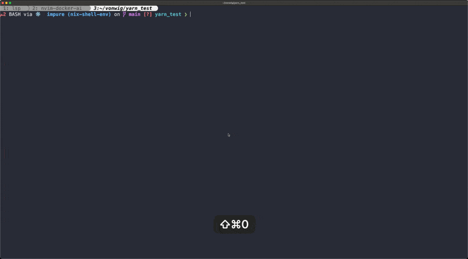
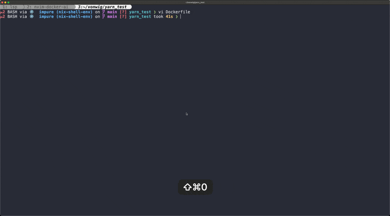

# nvim-copilot

## What is this

This project implements a very simple copilot-like experience in a terminal-based editor (neovim)
using local LLMs.  We are exploring 2 things here.

* can we create copilot-like experiences using only local LLMs?
* how easily can we add llm prompts to a terminal-based editor like neovim?

Here's an example of highlighting some text in a buffer (any buffer), and then using `<leader>ai` to ask the 
LLM a question about this text.


In the next example, we use the command `:GenerateRunbook` to have an LLM generate runnable markdown containing
advice on how to use Docker in the current project.



This plugin also starts an LSP which provides language services for both 
Dockerfiles and Docker compose.yaml files.  Here's an example of the LSP providing completions for a Dockerfile.



## How do you use this

This is distributed as a standard neovim plugin module.  After installing, highlight some text in the buffer 
and type `<leader>ai` to ask the LLM a question about the highlighted text.

## Installation

Much of the functionality included in this plugin is delivered using Docker images.  When running for the first
time, things will start up slowly as images are pulled.

Also note that that runbook generation and the `<leader>ai` commands require access to OPENAI.  See [Using Openai](#using-openai) for instructions
on configuring your API key.

### Installing with Lazy

If you're using [lazy](https://github.com/folke/lazy.nvim), then add `docker/labs-nvim-copilot` to your setup.

```lua
require('lazy').setup(
  { 
    {
      'docker/labs-nvim-copilot',
      lazy=false,
      dependencies = {
        'Olical/aniseed',
        'nvim-lua/plenary.nvim',
        'hrsh7th/nvim-cmp'
      },
      config = function(plugin, opts)
        require("docker.setup").setup({})
      end,
    },
    {
      'hrsh7th/nvim-cmp',
      dependencies = {'hrsh7th/cmp-buffer',
                      'hrsh7th/cmp-nvim-lsp', }
    },
  }
)
```

This will create a set of default key bindings for the LSP.  See [Key bindings](#key-bindings) for instructions on how to configure your own custom
bindings.

### Using Ollama

If you have [Ollama installed](https://ollama.ai/) installed and running, this plugin
will sometimes ask if you want to use it.  Managing the Ollama instance is separate from
the lifecycle of starting and stopping neovim. If you want to try local LLMs, you'll have to make sure
an Ollama server is listening on port `11434`.

### Using Openai

If you don't have Ollama installed, the plugin will default to using Openai. However, this requires an API key, which can be set 
in two ways.

1.  Set the `OPENAI_API_KEY` environment variable before you start neovim.
2.  Create a file called `.open-api-key` in your `$HOME` directory and write they key in this file.

### Commands

* **:GenerateRunbook** - generate a runbook markdown file for the current project
* **:RunbookRegister** - register a github ref containing prompts for a new runbook type
* **:RunbookUnregister** - unregister a runbook type
* **:DockerDebug** - download internal representations of project context for debug

## Key bindings

The default bindings are listed below.

| Mode   | Key binding   | Description |
| :----  | :------       | :----- |
| visual | `<leader>ai`  | Ask a question about the selected text |
| normal | `<leader>K`   | Show hovers at cursor |
| normal | `<leader>la`  | Show code actions at cursor |
| normal | `<leader>le`  | Show diagnostics |
| normal | `<leader>run` | Select a named Runbook Codeblock to run in the terminal |

You can change these bindings using Lazy config from [Installing with Lazy].  The `setup` function
in `docker.setup` takes a table with an attach handler that that will allow you to customize the key mappings.

```lua
        require("docker.setup").setup({attach = function()
          vim.api.buf_set_keyamp(bufnr, "v", "<leader>ai",  "<cmd>lua require('nano-copilot').copilot()<CR>", {noremap = true})
          vim.api.buf_set_keyamp(bufnr, "n", "<leader>la",  "<cmd>lua vim.lsp.buf.code_action()<CR>", {noremap = true})
          vim.api.buf_set_keyamp(bufnr, "n", "<leader>le",  "<cmd>lua vim.diagnostic.open_float()<CR>", {noremap = true})
          vim.api.buf_set_keyamp(bufnr, "n", "K",           "<cmd>lua vim.lsp.buf.hover()<CR>", {noremap = true})
          vim.api.buf_set_keyamp(bufnr, "n", "<leader>run", "<cmd>lua require('lsps').runInTerminal()<CR>", {noremap = true})
        end})
```

### Building

```sh
# docker:command=build

make
```

